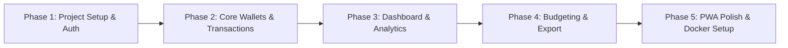

# Product Requirements Document (PRD)
# Self-Hosted Multi-User Personal Finance Tracker (iOS PWA)

## 1. Project Overview

### 1.1 Ringkasan
Aplikasi pelacak keuangan pribadi (*Personal Finance Tracker*) mandiri (*self-hosted*) yang dirancang khusus untuk penggunaan keluarga dengan model akun privat/terisolasi. Aplikasi ini dioptimalkan sebagai **Progressive Web App (PWA)** untuk perangkat mobile (khususnya iOS/iPhone) dan dijalankan di **home-server** berbasis Node.js & Docker.

### 1.2 Tujuan Utama
1. **Pencatatan Cepat (*Quick Logging*):** Memudahkan pencatatan pengeluaran & pemasukan dalam waktu kurang dari 10 detik dengan antarmuka yang ramah jempol (*thumb-friendly*).
2. **Privasi 100% & Terisolasi:** Setiap anggota keluarga memiliki akun tersendiri; data saldo, dompet, dan transaksi tidak bercampur.
3. **Self-Hosted & Ringan:** Berjalan di home-server dengan konsumsi memori rendah, 100% kompatibel dengan Node.js/npm standar (tanpa ketergantungan instruksi CPU khusus).
4. **Pengalaman Native di iOS (PWA):** Tampilan fullscreen (*standalone*), mendukung *safe area insets* (Notch/Dynamic Island), icon home screen, dan sesi login yang tahan lama.

---

## 2. Tech Stack & Arsitektur

| Komponen | Teknologi | Keterangan |
| :--- | :--- | :--- |
| **Framework** | Next.js (App Router) + TypeScript | Fullstack monolith (Frontend + API Routes) |
| **Runtime & PM** | Node.js (v20+ LTS) & `npm` | Kompatibel penuh dengan CPU home-server |
| **Database** | SQLite (`better-sqlite3` / LibSQL) | Berbasis 1 file lokal, super cepat, backup mudah |
| **ORM** | Drizzle ORM | Type-safe, performa tinggi, migrasi otomatis |
| **Styling** | Tailwind CSS + Lucide Icons | Desain modern, clean dark/light mode, mobile-first |
| **Auth** | Session Auth + `bcryptjs` | Password hashing aman, cookie HTTP-only persistent |
| **Deployment** | Docker & Docker Compose | Multi-stage build hemat resource (< 150MB RAM) |

---

## 3. Skema Data (Database Schema)

```
┌────────────────────────────────────────────────────────┐
│                        users                           │
│  id, name, email, password_hash, currency, created_at  │
└───────────┬───────────────┬──────────────┬─────────────┘
            │               │              │
            ▼               ▼              ▼
     ┌─────────────┐ ┌─────────────┐ ┌─────────────┐
     │   wallets   │ │ categories  │ │   budgets   │
     │  (user_id)  │ │  (user_id)  │ │  (user_id)  │
     └──────┬──────┘ └──────┬──────┘ └─────────────┘
            │               │
            ▼               ▼
     ┌─────────────────────────────┐
     │        transactions         │
     │  (user_id, wallet, cat, ..) │
     └─────────────────────────────┘
```

### 3.1 Entitas Data
1. **`users`**
   * `id` (UUID/Text PK)
   * `name` (Text)
   * `email` (Text, Unique)
   * `password_hash` (Text)
   * `currency` (Text, Default: 'IDR')
   * `is_admin` (Boolean, Default: false - user pertama jadi admin)
   * `created_at` (Timestamp)

2. **`wallets` (Dompet / Akun Bank)**
   * `id` (UUID PK)
   * `user_id` (FK -> users.id)
   * `name` (Text, contoh: "BCA Utama", "Dompet Tunai", "GoPay")
   * `type` (Enum: `BANK`, `EWALLET`, `CASH`, `CREDIT_CARD`, `OTHER`)
   * `initial_balance` (Integer/BigInt - dalam satuan terkecil/Rupiah)
   * `color` & `icon` (Text)
   * `is_archived` (Boolean, Default: false)
   * `created_at` (Timestamp)

3. **`categories` (Kategori Pengeluaran & Pemasukan)**
   * `id` (UUID PK)
   * `user_id` (FK -> users.id)
   * `name` (Text, contoh: "Makanan & Minuman", "Gaji", "Transportasi")
   * `type` (Enum: `EXPENSE`, `INCOME`)
   * `icon` & `color` (Text)
   * `created_at` (Timestamp)

4. **`transactions` (Mutasi Keuangan)**
   * `id` (UUID PK)
   * `user_id` (FK -> users.id)
   * `wallet_id` (FK -> wallets.id)
   * `category_id` (FK -> categories.id, Nullable untuk tipe TRANSFER)
   * `destination_wallet_id` (FK -> wallets.id, Nullable, hanya untuk TRANSFER)
   * `type` (Enum: `EXPENSE`, `INCOME`, `TRANSFER`)
   * `amount` (BigInt/Integer)
   * `date` (Timestamp/Date)
   * `notes` (Text, Optional)
   * `created_at` (Timestamp)

5. **`budgets` (Alokasi Anggaran Bulanan)**
   * `id` (UUID PK)
   * `user_id` (FK -> users.id)
   * `category_id` (FK -> categories.id)
   * `amount_limit` (BigInt)
   * `month` (Integer 1-12)
   * `year` (Integer)

6. **`system_settings`**
   * `allow_registration` (Boolean, default: true saat pertama kali, bisa dimatikan oleh admin).

---

## 4. Kebutuhan Fungsional (Functional Requirements)

### 4.1 Autentikasi & Multi-User Isolation
* **FR-1.1 Register & Login:** Setiap user mendaftar dengan nama, email, dan password.
* **FR-1.2 Private Data:** Query database selalu menyertakan filter `WHERE user_id = current_user_id`. Tidak ada API yang membocorkan data lintas akun.
* **FR-1.3 Registration Toggle:** Admin dapat mengunci registrasi publik setelah seluruh anggota keluarga terdaftar.
* **FR-1.4 Persistent Session:** Sesi PWA bertahan hingga 30–90 hari tanpa auto-logout mendadak.

### 4.2 Manajemen Dompet (Wallets)
* **FR-2.1 CRUD Dompet:** Menambah dompet baru dengan tipe (Bank, E-Wallet, Cash), saldo awal, icon, dan warna.
* **FR-2.2 Realtime Balance Calculation:** Saldo saat ini dihitung secara dinamis:
  $$\text{Saldo} = \text{Saldo Awal} + \sum \text{Pemasukan} - \sum \text{Pengeluaran} \pm \sum \text{Transfer}$$
* **FR-2.3 Arsip Dompet:** Dompet yang sudah tidak aktif bisa diarsipkan tanpa menghapus histori transaksi lama.

### 4.3 Kategori (Categories)
* **FR-3.1 Kategori Default:** Saat user baru mendaftar, otomatis dibuatkan kategori standar (Makan & Minum, Belanja, Transport, Tagihan, Hiburan, Gaji, Bonus, dll).
* **FR-3.2 Kustomisasi Kategori:** User bisa menambah, mengedit nama, icon, warna, atau menghapus kategori miliknya.

### 4.4 Pencatatan Transaksi (Quick Entry)
* **FR-4.1 Quick Entry Bottom Sheet:** Tombol (+) melayang di navigasi bawah untuk input instan.
* **FR-4.2 Tiga Tipe Transaksi:**
  * *Pengeluaran:* Mengurangi saldo dompet asal, wajib pilih kategori pengeluaran.
  * *Pemasukan:* Menambah saldo dompet tujuan, wajib pilih kategori pemasukan.
  * *Transfer:* Memindahkan saldo dari Dompet A ke Dompet B (tanpa kategori pengeluaran).
* **FR-4.3 Shortcut Input:** Format angka otomatis (Rupiah), tombol cepat `000` / `k`, default ke tanggal hari ini dan dompet utama.
* **FR-4.4 Filter & Cari:** Riwayat transaksi dapat difilter berdasarkan bulan, rentang tanggal, kategori, atau dompet.

### 4.5 Dashboard & Laporan Visual
* **FR-5.1 Ringkasan Kas Bulanan:**
  * Total Saldo Keseluruhan (Net Worth).
  * Total Pemasukan Bulan Ini.
  * Total Pengeluaran Bulan Ini.
  * Arus Kas Bersih (Net Cashflow = Pemasukan - Pengeluaran).
* **FR-5.2 Grafik Pengeluaran:**
  * Breakdown pengeluaran per kategori (Donut Chart / Bar Chart).
  * Tren pengeluaran harian sepanjang bulan berjalan.
* **FR-5.3 Daftar Transaksi Terakhir:** Menampilkan 5-10 transaksi terbaru di halaman beranda.

### 4.6 Anggaran / Budgeting (Phase 2)
* **FR-6.1 Limit per Kategori:** Pasang target anggaran bulanan per kategori.
* **FR-6.2 Status & Progress Bar:** Menampilkan persentase penggunaan budget (Hijau < 75%, Kuning 75-90%, Merah > 100%).

### 4.7 Backup & Export
* **FR-7.1 Export CSV:** Unduh riwayat transaksi dalam format CSV untuk dibuka di Excel/Google Sheets.
* **FR-7.2 Database Backup:** Kemudahan meng-copy file `finance.db` atau unduh backup dari halaman admin.

---

## 5. Kebutuhan Non-Fungsional & Desain UX (iOS PWA First)

### 5.1 Mobile-First & iOS PWA Experience
* **Viewport & Safe Areas:** Menggunakan `viewport-fit=cover` dengan padding `env(safe-area-inset-top)` dan `env(safe-area-inset-bottom)`.
* **Navigasi Bawah (Bottom Navigation Bar):** Fixed di bawah layar:
  * 🏠 **Beranda** (Dashboard & Ringkasan)
  * 📊 **Laporan** (Analisis & Grafik)
  * ➕ **Quick Add** (Tombol menonjol di tengah)
  * 💳 **Dompet** (Daftar & Detail Dompet)
  * ⚙️ **Pengaturan** (Profil, Kategori, Export, Keamanan)
* **Touch Targets:** Seluruh tombol dan area klik berukuran minimal 44x44 px sesuai iOS Human Interface Guidelines.
* **Tampilan:** Modern sleek dark mode & light mode, tipografi tajam (Inter / Geist), micro-animations pada transisi kartu dan tombol.

### 5.2 Performa & Resource Home-Server
* **RAM Footprint:** < 150 MB saat container berjalan.
* **Kecepatan Respons:** Query SQLite lokal menghasilkan latensi API < 50ms.
* **Kompabilitas:** Menggunakan image `node:20-alpine` atau `node:20-slim` standar.

---

## 6. Rencana Tahapan Eksekusi (Roadmap)



* **Phase 1: Inisialisasi & Fondasi Auth**
  * Inisialisasi Next.js (TypeScript, Tailwind, Drizzle ORM, SQLite).
  * Setup skema database & migrasi.
  * Sistem Auth (Register, Login, Session, Registration Lock).
* **Phase 2: Manajemen Dompet, Kategori & Quick Transaction**
  * CRUD Dompet & Kategori (dengan default seeder).
  * Quick Add Transaction Bottom Sheet & form input.
  * Riwayat transaksi + kalkulasi saldo otomatis.
* **Phase 3: Dashboard & Visualisasi Laporan**
  * Halaman Beranda (Net worth, Cashflow summary, Recent transactions).
  * Halaman Laporan (Charts pengeluaran per kategori & tren bulanan).
* **Phase 4: Budgeting, Export & Fitur Lanjutan**
  * Sistem budget bulanan per kategori.
  * Export data ke CSV.
* **Phase 5: iOS PWA Optimization & Docker Deployment**
  * Manifest PWA, service worker, splash screen & app icon.
  * Multi-stage `Dockerfile` & `docker-compose.yml` dengan volume mapping untuk database SQLite.
